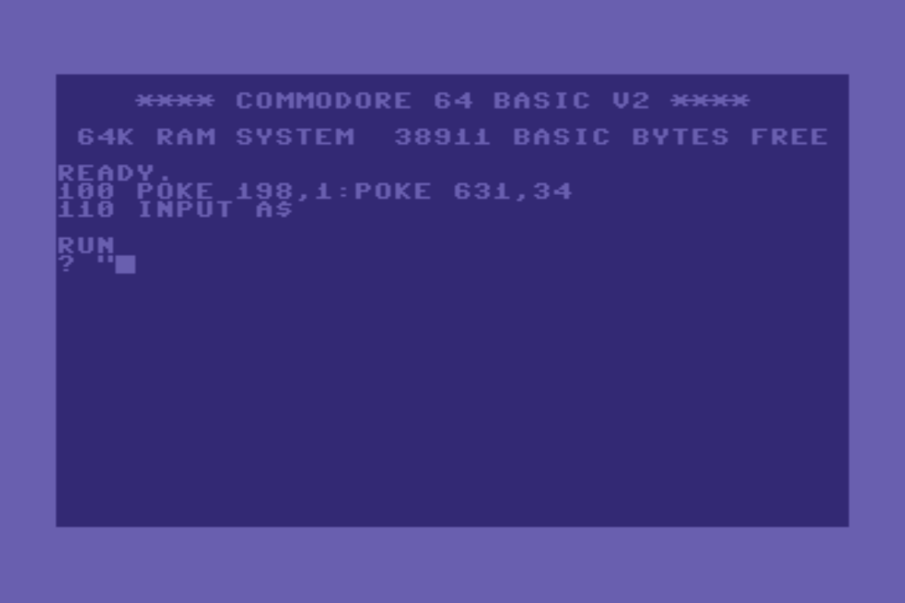
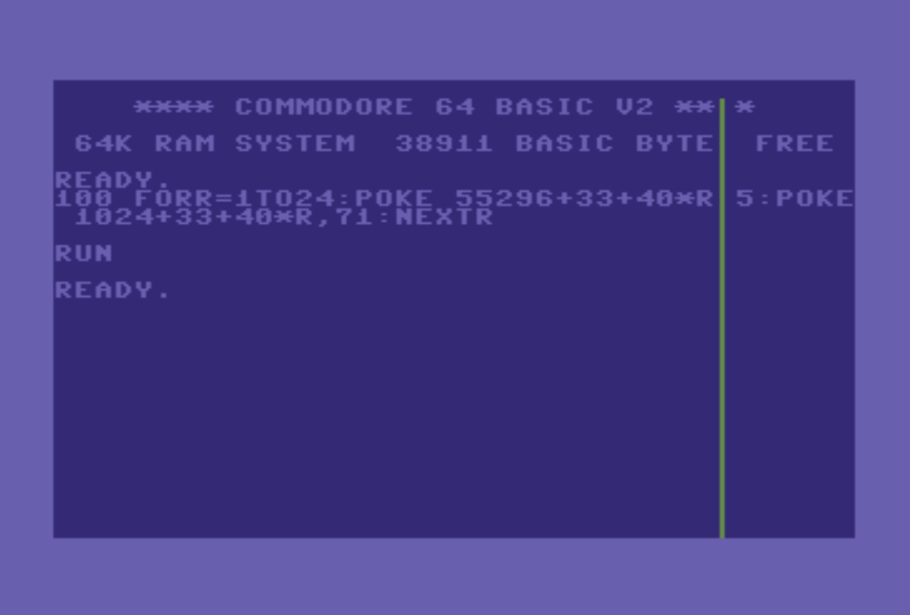

## COLORED LIST

Press `CTRL + ?`

```basic
100 PRINT "HELLO"
110 REM "{COLOR}
120 PRINT "HELLO"
```

## QUOTE INPUT



```basic
100 POKE 198,1:POKE 631,34
110 INPUT A$
```

## VERTICAL LINE



```basic
100 FOR R =1 TO 24:POKE 55296+33+40*R,5:POKE 1024+30+40*R,71:NEXT R
```

## CURSOR BLINKING

```basic
POKE 788,55 : REM OR POKE 788,60 OR 78 OR 77 OR 71 OR 72 OR 73
```

## Typewriter effect

Below the version without any special char. Just to be sure that you will be able to display the effect.

```basic
100 A$="THIS IS A TEST"
110 FOR I = 1 TO LEN(A$)
120 PRINT MID$(A$,I,1);: REM ONE SINGLE CHAR
122 PRINT CHR$(18);: REM REVERSE ON
124 PRINT " ";: REM THE CURSOR
126 PRINT CHR$(146);: REM REVERSE OFF
128 PRINT CHR$(157);: REM CURSOR LEFT
130 FOR J = 1 TO 50:NEXT J
140 NEXT I: PRINT " "
```

In the video below the effect is shown with the special char.

<video src="images/typewriter.mov"></video>
