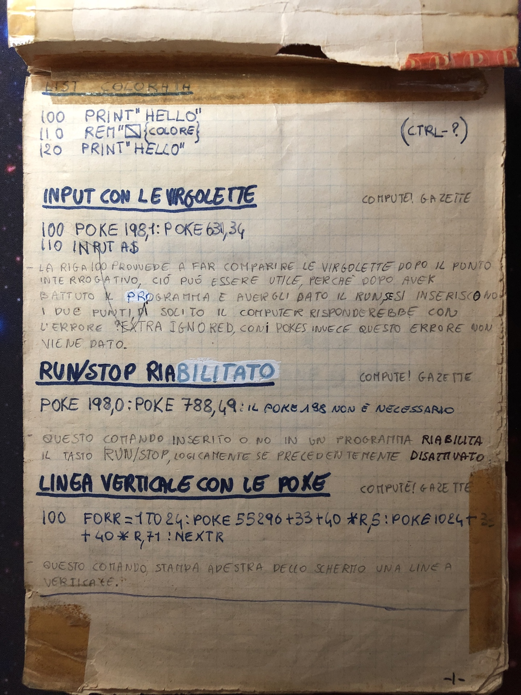
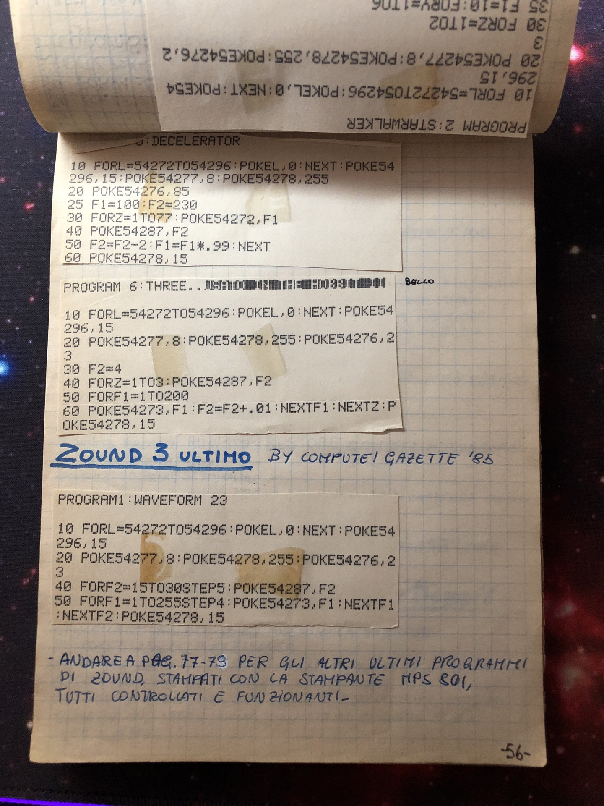

# Welcome to the Commodore-64 Tips & Tricks!

## Original photos

## Emulator

If you're a passionate lover of the Commodore 64 but you haven't got it, you may use the online and desktop emulator below:

- [Online Javascript](https://c64emulator.111mb.de/index.php?site=pp_javascript&group=c64)
- [Vice](https://vice-emu.sourceforge.io/index.html)
- [6502 Assembler](https://www.masswerk.at/6502/assembler.html)
- [6502 Emulator](https://www.masswerk.at/6502/#)

## Tips & Tricks

- [Basic GFX](basic-gfx.md)
- [Colored List](basic-gfx#colored-list)
